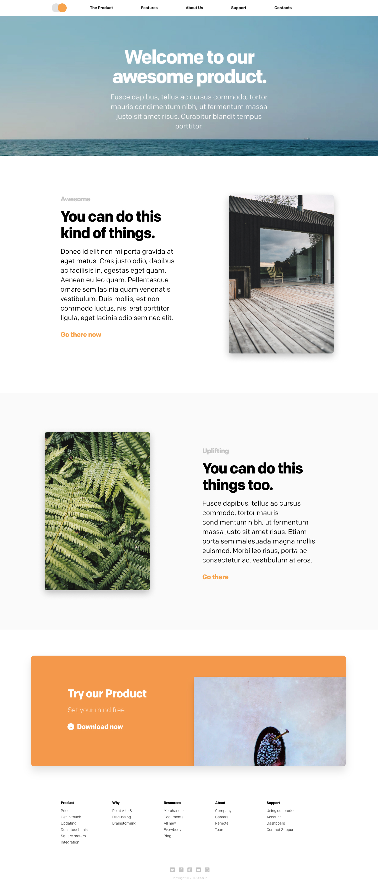
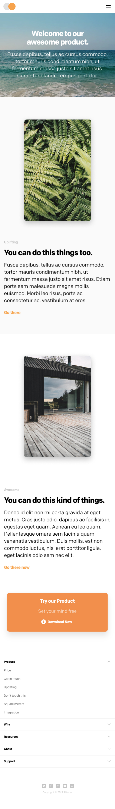

# Altar: Sass gig

## STEPS

1. Fork the project
2. Clone it to your computer
3. Create a branch with your name (ex: andre-pinto)
4. Develop under that branch
5. Run `gulp build` at the end
6. Submit a Pull Request to us

## INSTALLATION

1. Open **Terminal** if you are on macOS or **CMD** if on Windows
2. Open the project folder (`cd project/`)
3. Run `npm install` --> install local dependencies from **package.json**
4. Run `npm install gulp` --> install local gulp dependency

### DEVELOP

1. Run `gulp watch` --> (runs the project in dev mode, starts a local server and opens the window on the local server endpoint)
2. Run `gulp build` --> (generate build)

---

### REQUIREMENTS

It doesn't have to be perfect. Font sizes, colors, etc, don't have to be the exactly the same. We give more value to those who **DON'T** any library to produce the result. Anything can be done using only with HTML and Sass. All images are provided in `src/assets/images/` folder.

### FINISH

When you finish you should run `gulp build` to generate all files into the `build/` folder.

### OUTPUT

The output should be a responsive version of these next images.

---

#### Desktop

---

#### Phone

---

## Tech

The source files (editable) are located in the `src/` folder.
To ensure the integrity of the project you should only edit these files inside this folder.
The gulp scripts are able to handle with preprocessing (html, sass, etc...)
